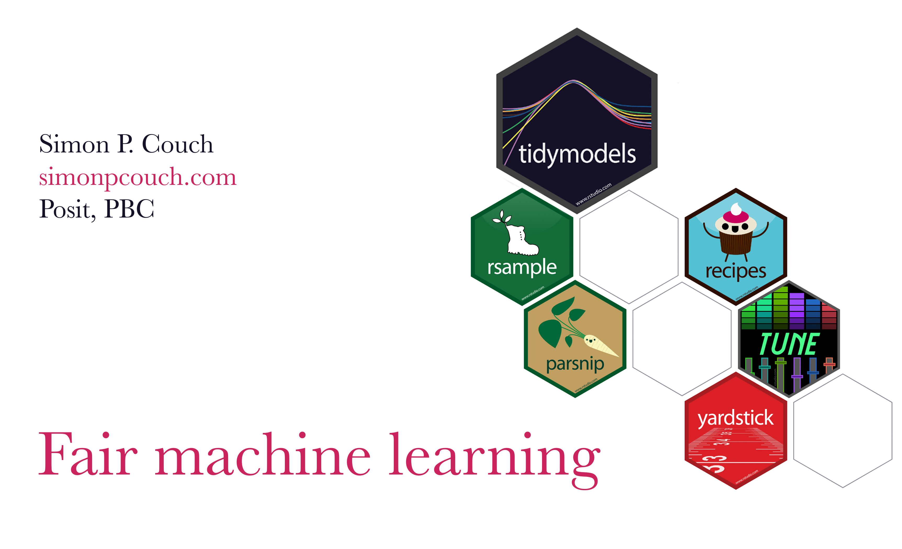

This repository contains source code and slides for the talk "Fair machine learning" at [Cascadia R Conf](https://cascadiarconf.org/) in June 2024. The **slides** for the talk are available [here](https://simonpcouch.github.io/cascadia-24).

To learn more about machine learning with R:

- Machine learning with tidymodels: [tmwr.org](tmwr.org)
- More example notebooks with tidymodels are at [tidymodels.org](tidymodels.org). Two fairness-oriented ones:
  * [Are GPT detectors fair?](https://www.tidymodels.org/learn/work/fairness-detectors/), focused on how different fairness metrics encoded different interpretations of fairness across linguistic proficiency.
  * [Fair prediction of hospital readmission](https://www.tidymodels.org/learn/work/fairness-readmission/), focused on training models that are near-fair with respect to a set of fairness metrics across racial groups.

I mentioned these works in the talk:

* [ccao-data/public](github.com/ccao-data/public) from folks at the Cook County Assessor's Office—source code for a talk that inspired the property assessment example.
* [An Unfair Burden](https://apps.chicagotribune.com/news/watchdog/cook-county-property-tax-divide/assessments.html) by Jason Grotto in 2017, an article from the Chicago Tribune investigating unfairness in Cook County's property tax system.
* [How Lower-Income Americans Get Cheated on Property Taxes](https://www.nytimes.com/2021/04/03/opinion/sunday/property-taxes-housing-assessment-inequality.html) from the NYTimes Editorial Board in 2021, which performs a similar analysis across counties in the US and additionally engages with the racial disparities in property taxation.
* [Algorithmic Fairness: Choices, Assumptions, and Definitions](https://www.annualreviews.org/content/journals/10.1146/annurev-statistics-042720-125902) from Mitchell et al. in 2021. A great reference for the various choices and assumptions that underlie fairness-oriented analysis of ML models.

----

In this repository,

-   `index.qmd` contains the source code for the slides. The slides use images in the `/figures` directory.
-   `/docs` is auto-generated from `index.qmd`. Content in that folder is likely unhelpful for a human reader, and is better viewed at the links above. :)
